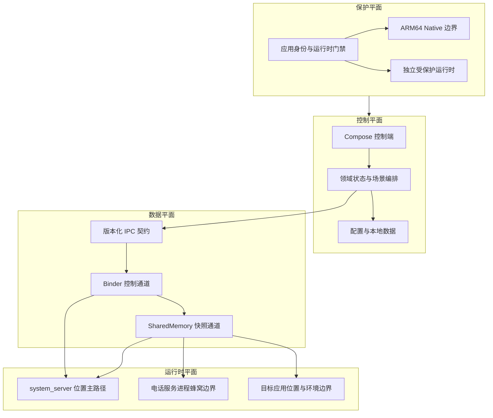
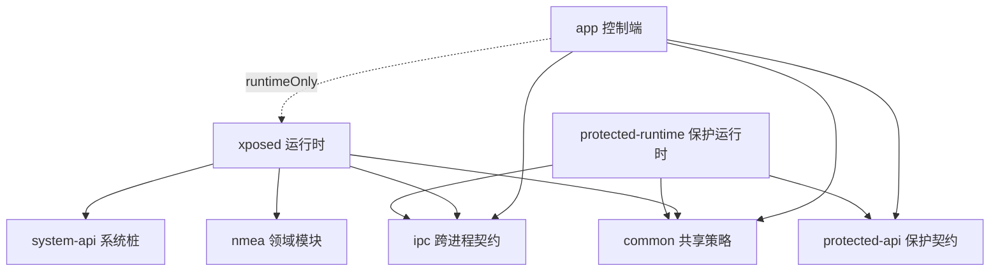
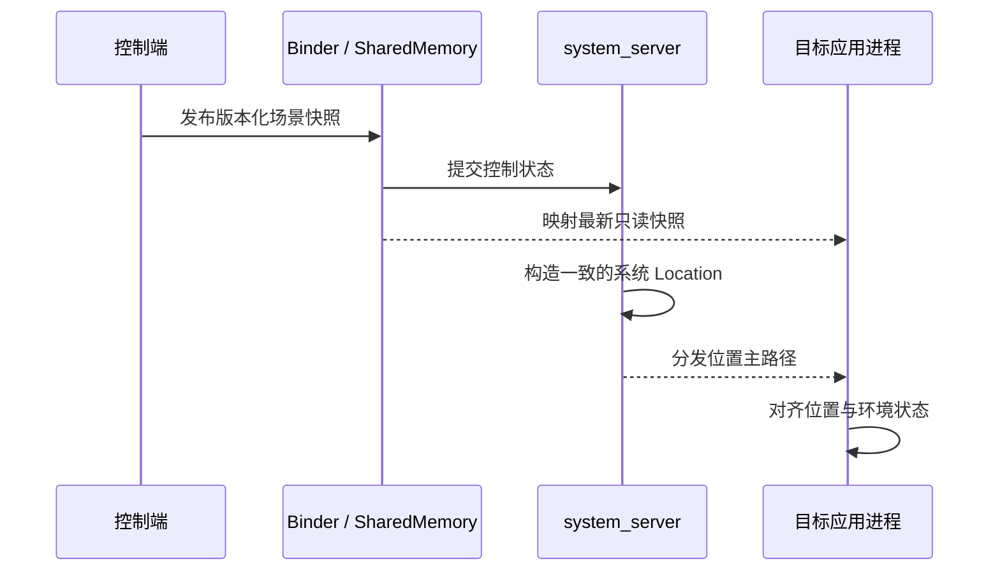

# HLocation

> Android 多进程定位与环境一致性架构

HLocation 以 Android 系统服务为位置数据主边界，以目标应用进程为环境一致性边界，并由独立控制端管理场景状态。整体采用模块化 Kotlin、Binder 控制通道、SharedMemory 数据平面和 ARM64 Native 运行时边界。

## 技术栈

| 领域 | 技术 |
| --- | --- |
| Android | minSdk 26、targetSdk 36、compileSdk 37、ARM64 |
| 语言 | Kotlin 2.3.20、C++ 17 |
| 系统扩展 | LSPosed、libxposed API 102 |
| UI | Jetpack Compose、Material 3、Navigation 3 |
| 状态与并发 | Coroutines、Flow、StateFlow |
| 数据与依赖 | Room、KSP、Koin、Kotlin Serialization |
| 地图 | 高德 3DMap 与搜索 SDK |
| IPC | Binder、SharedMemory、版本化快照协议 |
| Native | Android NDK、CMake |
| 构建 | AGP 9、Gradle 9、JDK 17 |

## 系统架构

### 控制平面

Compose 控制端、地图交互、模拟状态、环境配置与持久化通过 ViewModel 和领域协调器分离。控制端只依赖稳定契约，不直接依赖 Hook 内部实现。

### 数据平面

Binder 负责连接、配置提交和兼容事务，SharedMemory 负责多进程高频只读快照。配置版本与运行时位置序号独立推进，策略变更和位置推进拥有不同的仲裁语义。

### 运行时平面

- `system_server` 承载 IPC 骨干和系统位置主路径。
- 电话服务进程承载蜂窝服务边界。
- 目标应用进程承载应用侧位置一致性以及 WiFi、Cell、BLE、Sensor、GNSS 和网络环境边界。

系统位置、应用位置和周边环境消费同一份版本化状态，跨进程故障域彼此隔离。

### 保护平面

应用身份、受保护运行时与 Native 映像边界独立校验。保护逻辑只约束控制端，不进入 `system_server` 或目标应用的高频位置路径。

## 模块架构

| 模块 | 架构职责 |
| --- | --- |
| `:app` | Compose 控制端、地图交互、状态编排与持久化 |
| `:xposed` | libxposed 生命周期与多进程运行时边界 |
| `:ipc` | Binder 契约、SharedMemory 编解码与版本仲裁 |
| `:common` | 纯 Kotlin 策略、模型与坐标契约 |
| `:system-api` | 编译期 Android 系统接口边界 |
| `:nmea` | 独立 NMEA 领域边界 |
| `:protected-api` | 控制端与保护运行时的稳定接口 |
| `:protected-runtime` | 独立构建和验证的保护运行时 |

## 数据契约

内部场景坐标使用 GCJ-02，进入 Android `Location` 边界前统一转换为 WGS-84。单次位置构造复用一个原子坐标快照，使经纬度、高度、精度、速度和航向保持同源。

## 架构约束

- 配置由单一版本化状态源驱动。
- 系统位置主路径与应用进程兜底路径相互独立。
- 位置字段按单次原子快照保持一致。
- 平台差异集中在 Android/OEM 适配层。
- 高频运行路径不执行网络、持久化或同步文件写入。
- API 27 以上使用 SharedMemory，API 26 保留 Binder 读取路径。
- ARM64 运行时按设备页尺寸适配 4 KiB 与 16 KiB 环境。
