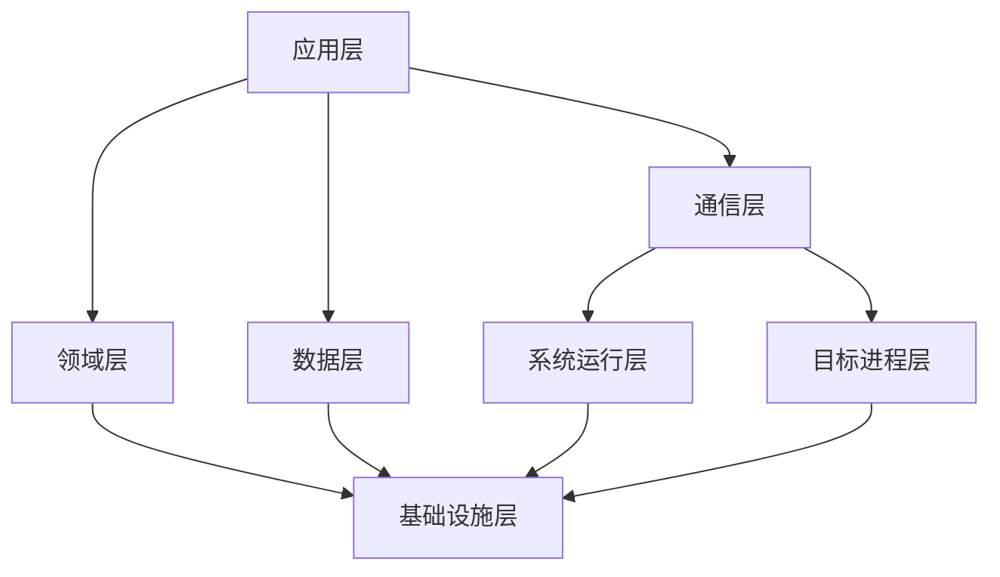

# HLocation

HLocation 是一款面向 Android 的位置场景工具，基于 LSPosed 构建，采用多进程、多模块的分层架构。

---

## 技术栈

| 领域 | 技术 |
| --- | --- |
| 语言 | Kotlin（业务与模块）、C/C++（运行时边界） |
| UI | Jetpack Compose + Material 3 |
| 异步 | Kotlin Coroutines + Flow / StateFlow |
| 依赖注入 | Koin |
| 持久化 | Room |
| 注入框架 | LSPosed（libxposed） |
| 跨进程通信 | Binder + SharedMemory |
| 地图 | 高德地图 SDK |
| 密码学 | 椭圆曲线签名（P-256）、AEAD 对称加密（GCM） |
| 构建 | AGP + Gradle + KSP + CMake + NDK |
| 持续集成 | GitHub Actions |
| 发布工具链 | Python（签名、校验、发布、自动化运维） |

---

## 整体架构

项目采用分层与多进程结合的设计，模块之间只通过稳定的数据契约通信，运行配置以版本化快照跨进程同步。

| 层 | 职责 |
| --- | --- |
| 应用层 | 界面、配置、地图、路线与状态管理 |
| 领域层 | 共享模型、业务策略与纯逻辑（不依赖平台） |
| 数据层 | 配置、环境数据与本地持久化 |
| 通信层 | 跨进程的配置与状态同步 |
| 系统运行层 | 系统进程内的位置与运行时能力 |
| 目标进程层 | 目标应用进程内的位置与环境一致性 |
| 基础设施层 | 构建、测试、签名、完整性与自动化发布 |

### 进程模型

- **控制进程**：用户配置入口，负责场景、策略与状态管理。
- **系统进程**：位置分发链路的注入边界，承载系统级能力。
- **目标进程**：环境一致性的注入边界，承载应用级能力。

三个角色通过版本化快照协同，任一角色失败都不会破坏其余角色的运行。

---

## 跨进程同步

### 共享内存主通道

跨进程配置同步采用共享内存单写多读模型：

- 发布区由系统进程创建并管理，客户端通过 Binder 事务获取映射句柄，之后不再依赖逐次 IPC。
- 写端一次写入，全部映射端即时可见，读取路径无锁、无系统调用。
- 发布区采用发布头 + 多槽位设计：写端原子切换当前代次，读端基于单调递增的序号读取完整快照，天然避免读写撕裂。
- 帧结构带魔法值、协议版本、修订计数与完整性校验；未知版本、校验失败、字段越界、畸形编码一律整体拒绝（fail-closed），不存在部分采用。

### 兼容与降级

- 较新平台使用内核共享内存原语；不支持的环境自动降级到传统映射 + 反射句柄路径。
- 备用命令通道作为兜底：主通道不可用时自动切换，保证配置仍可到达全部进程。
- 跨进程数据全部经过版本仲裁：只接受单调推进的更新，严格拒绝回滚。

### 一致性语义

- 配置版本与运行时推进序号语义分离：策略变更与运行时推进互不干扰，避免长时间运行后版本漂移。
- 多字段读取始终来自同一原子快照，杜绝字段交叉污染。
- 崩溃后可恢复：本地持久化与进程内状态分离，重启后自动恢复并补做已到期检查。

---

## 蜂窝环境算法

蜂窝环境采用“真实数据优先、确定性生成兜底”的策略，并保持区域与信号一致性。

### 数据来源优先级

1. 真实采集的环境快照：直接使用，不做任何改写。
2. 开放基站数据库匹配：按坐标在限定半径内检索真实记录。
3. 确定性生成：无数据时的兜底方案。

### 确定性生成

- 以坐标作为稳定种子派生环境，同一地点重复生成完全一致，避免环境跳变。
- 小区按区域成簇：区域码、基站编号、小区标识在同一地理簇内连续分布。
- 物理小区标识遵循运营商规划习惯，相邻小区间保持间隔，避免冲突。
- 生成规模按区域动态变化，主小区与邻区数量符合真实网络拓扑。

### 信号模型

- 主小区信号最强，邻区按距离与拓扑依次递减，形成符合物理规律的梯度。
- 信号质量字段基于 3GPP 标准路损模型与距离推算，并叠加低权重数据库统计，接近真实测量分布。
- 定时提前只出现在主小区，邻区不携带。
- 匹配模式下，候选仅来自半径内的真实记录，并按 serving 连续性规则选择主小区，避免频繁切换。

### 一致性

所有维度（蜂窝、WiFi、蓝牙、传感器）共享同一配置快照生成，同一时刻观察到的多字段来自同一状态，避免单一维度暴露。

---

## WiFi 与其他环境

- WiFi 环境优先使用真实扫描快照；无快照时由确定性生成器产出，使用真实厂商前缀的地址空间，保证外观可信。
- 蓝牙与信标环境同样遵循真实优先、确定性兜底。
- 传感器输出与位置上下文联动，保持时序与数值自洽。

---

## 加固与安全设计

### 信任链

- 设备内置离线信任锚，首次信任建立不依赖任何在线服务。
- 多层委托：根信任锚只签发层级凭证，日常更新由受限委托密钥完成，根密钥不参与常规流程。
- 密钥按用途隔离：不同用途的密钥不可互用，签名域与消费端双重校验。
- 签名采用椭圆曲线（P-256）；对称加密采用 AEAD（GCM）模式，密文与附加数据绑定。

### 密钥管理

- 根私钥离线保存，不进入服务器、CI、仓库或设备。
- 日常发布只使用权限受限的委托密钥。
- 文档、仓库与日志中不出现任何密钥材料。

### 发布安全

- 发布采用原子提交与比较交换：仅在分支未推进时写入，并发冲突自动放弃，绝不覆盖。
- 新版本与旧版本保持重叠窗口，保证分发网络传播期间始终存在有效版本。
- 单调版本号 + 防回滚：客户端一旦接受更高版本，就拒绝旧版本回滚。
- 发布后双重复验：先按精确提交复核字节与签名，再从公网镜像路径验证可达性。
- 构建期强制远端验证：发布前完成完整签名链校验，未通过不得进入产物构建。

### 运行时门禁

- 全链路失败即关闭：任何验证未通过的状态都不会进入运行态。
- 消费端各自独立验签，结果互不信任：一个进程的验证结论不能代表另一个进程。
- 可信时间由本地单调时钟锚与已签文档共同维护，网络响应头不构成可信时间来源。
- 授权硬过期宽限为零：到期立即失效，不存在过期后宽限窗口。
- 运行时边界采用 Native 校验与受控加载，失败路径与诊断路径分离。

### 系统加固

- 服务器定时任务运行在独立低权限账户下，项目与密钥目录只读。
- systemd 沙箱：禁止提权、私有临时目录、严格文件系统保护、受限内核接口。
- 状态文件不含任何秘密，密钥与凭据仅存在于权限受限的私有环境文件。

---

## 注入能力面

以下为能力级描述。

### 系统服务层

- 位置分发链路：拦截位置查询与回调分发，保证注入结果的一致性。
- GNSS 抽象：提供与真实接收机一致的状态与输出形态，支持星座与可见性配置。
- 融合定位提供者：与其他定位来源统一仲裁。

### 应用进程层

- 定位管理器：应用侧回调与查询的最终一致性。
- 无线电环境：蜂窝网络信息，包括小区身份与信号质量形态。
- 无线网络环境：WiFi 扫描结果形态。
- 短距环境：蓝牙与信标形态。
- 传感器环境：与位置相关的传感器输出。
- 网络连接状态：与位置上下文相关的连接形态。

### 一致性策略

- 位置与周边环境同步注入，避免单一维度暴露。
- 所有维度共享同一配置快照。
- 不针对任何具体地图 SDK 做定制注入，保持通用兼容。

---

## 性能与优化

- 热路径零锁、零分配优先，广播与消费均为常量级操作。
- 热路径日志按比例采样，异步缓冲落盘，不在注入路径上同步写文件。
- 网络刷新按已签名时效与失败冷却自适应调度，失败退避、成功续期。
- 多镜像多路径可达，单一路径失效自动降级，无效文档直接拒绝并继续探测。

---

## 可靠性工程

- 双通道降级：主通道故障自动切备用，避免单点依赖。
- 全链路状态机：NOOP / PUBLISHED / FAILED 三态原子落盘。
- 自动化续期：签名验证文件到期前自动提前续期，严格保持发布重叠窗口。
- 主动告警：关键事件通过消息通道推送，日常静默、异常必达。

---

## 发布与分发

- 安装产物附带完整性 sidecar，与 `SHA256SUMS` 交叉校验。
- 签名验证文件与安装产物统一发布，版本可审计。
- 所有产物经构建期远端验证后才允许发布。

---

## Release

可安装产物通过 [Releases](https://github.com/sparr-sherrya/hlocation-release/releases) 发布。
