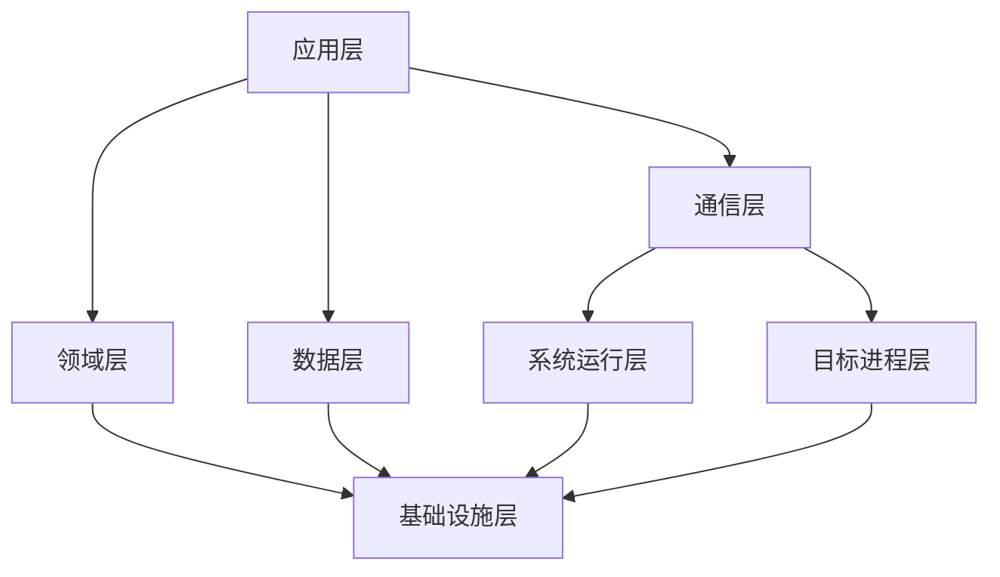

# HLocation

HLocation 是一款面向 Android 的位置场景工具，基于 LSPosed 构建，采用多进程、多模块的分层架构。

> 本仓库为公开分发仓库，仅保存安装产物、完整性校验文件和脱敏公共契约。本文档只描述架构级设计，不包含类级注入细节、内部协议字节、校验参数或任何可被用于逆向的具体实现信息。

---

## 技术栈

| 领域 | 技术 |
| --- | --- |
| 语言 | Kotlin（业务与模块）、C/C++（运行时边界） |
| UI | Jetpack Compose + Material 3 |
| 异步 | Kotlin Coroutines + Flow / StateFlow |
| 依赖注入 | Koin |
| 持久化 | Room |
| 注入框架 | LSPosed（libxposed） |
| 跨进程通信 | Binder + SharedMemory |
| 地图 | 高德地图 SDK |
| 构建 | AGP + Gradle + KSP + CMake + NDK |
| 持续集成 | GitHub Actions |
| 发布工具链 | Python（签名、校验、发布、自动化运维） |

---

## 整体架构

项目采用分层与多进程结合的设计，模块之间只通过稳定的数据契约通信，运行配置以版本化快照跨进程同步。

| 层 | 职责 |
| --- | --- |
| 应用层 | 界面、配置、地图、路线与状态管理 |
| 领域层 | 共享模型、业务策略与纯逻辑（不依赖平台） |
| 数据层 | 配置、环境数据与本地持久化 |
| 通信层 | 跨进程的配置与状态同步 |
| 系统运行层 | 系统进程内的位置与运行时能力 |
| 目标进程层 | 目标应用进程内的位置与环境一致性 |
| 基础设施层 | 构建、测试、签名、完整性与自动化发布 |

### 进程模型

- **控制进程**：用户配置入口，负责场景、策略与状态管理。
- **系统进程**：位置分发链路的注入边界，承载系统级能力。
- **目标进程**：环境一致性的注入边界，承载应用级能力。

三个角色通过版本化快照协同，任一角色失败都不会破坏其余角色的运行。

---

## 技术要点

### 跨进程同步

- 主通道采用共享内存单写多读，一次写入对全部映射端可见，避免逐进程序列化拷贝。
- 备用命令通道作为降级路径，主通道不可用时自动切换。
- 所有跨进程数据带版本仲裁：严格拒绝回滚，只接受单调推进的更新。

### 状态与一致性

- 运行状态以原子快照方式提交，一次读取得到完整一致的视图，避免多字段交叉污染。
- 配置与运行时序号语义分离：策略变更与运行时推进互不干扰。
- 崩溃后可恢复：本地持久化与进程内状态分离，重启后自动恢复并补做已到期检查。

### 性能与资源

- 热路径零锁、零分配优先，广播与消费均为常量级操作。
- 热路径日志按比例采样，日志异步缓冲落盘，不在注入路径上同步写文件。
- 网络刷新按已签名时效与失败冷却自适应调度，失败退避、成功续期。

---

## 加固与安全设计

### 信任链

- 设备内置离线信任锚，不依赖任何外部在线服务完成首次信任建立。
- 验证链为多层委托：根信任锚只签发层级凭证，日常更新由受限委托完成。
- 密钥按用途隔离：不同用途的密钥不可互用，签名域与消费端双重校验。

### 密钥管理

- 根私钥离线保存，不进入任何服务器、CI、仓库或设备。
- 日常发布只使用权限受限的委托密钥。
- 文档、仓库与日志中不出现任何密钥材料。

### 发布安全

- 发布采用原子提交与比较交换，并发推进时自动放弃，绝不覆盖他人更新。
- 新版本发布时与旧版本保持重叠窗口，保证分发网络传播期间始终存在有效版本。
- 单调版本号与防回滚策略：客户端一旦接受更高版本，就拒绝任何旧版本回滚。
- 发布后双重复验：先按精确提交复核，再从公网镜像路径验证可达性。

### 运行时门禁

- 全链路失败即关闭：任何验证未通过的状态都不会进入运行态。
- 运行时边界采用 Native 校验与受控加载，失败路径与诊断路径分离。
- 最小化注入面：只保留系统服务与目标进程两个边界，不劫持任何第三方 SDK。

---

## 注入能力面

以下为能力级描述，不涉及类级实现细节。

### 系统服务层

- 位置分发链路：拦截位置查询与回调分发，保证注入结果的一致性。
- GNSS 抽象：提供与真实接收机一致的状态与输出形态。
- 融合定位提供者：与其他定位来源统一仲裁。

### 应用进程层

- 定位管理器：应用侧回调与查询的最终一致性。
- 无线电环境：蜂窝网络信息，包括小区身份与信号质量形态。
- 无线网络环境：WiFi 扫描结果形态。
- 短距环境：蓝牙与信标形态。
- 传感器环境：与位置相关的传感器输出。
- 网络连接状态：与位置上下文相关的连接形态。

### 一致性策略

- 位置与周边环境同步注入，避免单一维度暴露。
- 所有维度共享同一配置快照，同一时刻观察到的多字段来自同一状态。
- 支持确定性生成与真实采集数据两种来源，优先使用真实数据，无数据时确定性兜底。
- 不针对任何具体地图 SDK 做定制注入，保持通用兼容。

---

## 可靠性工程

- 双通道降级：主通道故障自动切备用，避免单点依赖。
- 全链路状态机：NOOP / PUBLISHED / FAILED 三态原子落盘，状态文件不含任何秘密。
- 自动化续期：签名验证文件到期前自动提前续期，严格保持发布重叠窗口。
- 主动告警：关键事件通过消息通道推送，日常静默、异常必达。
- 服务器定时任务：独立低权限账户、只读运行目录、最小能力沙箱。

---

## 发布与分发

- 安装产物附带完整性 sidecar，与 `SHA256SUMS` 交叉校验。
- 签名验证文件与安装产物统一发布，版本可审计。
- 公共镜像多路径可达，单一路径失效自动降级。
- 所有产物经构建期远端验证后才允许发布。

---

## 公共契约

`public-contracts/` 目录包含与生产实现隔离的脱敏契约示例，仅用于展示数据建模与抽象边界，不是可构建的应用或兼容层。

---

## Release

可安装产物通过 [Releases](https://github.com/sparr-sherrya/hlocation-release/releases) 发布。
