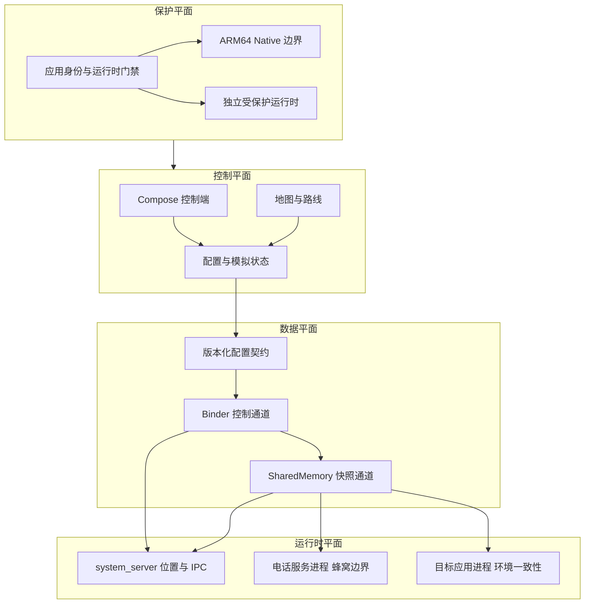
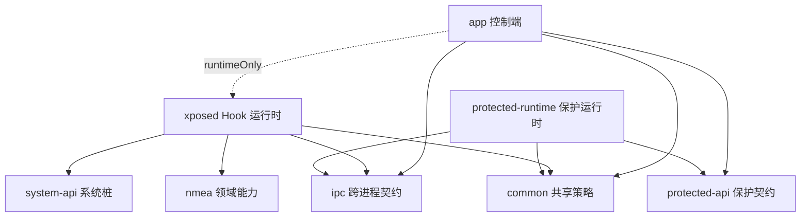
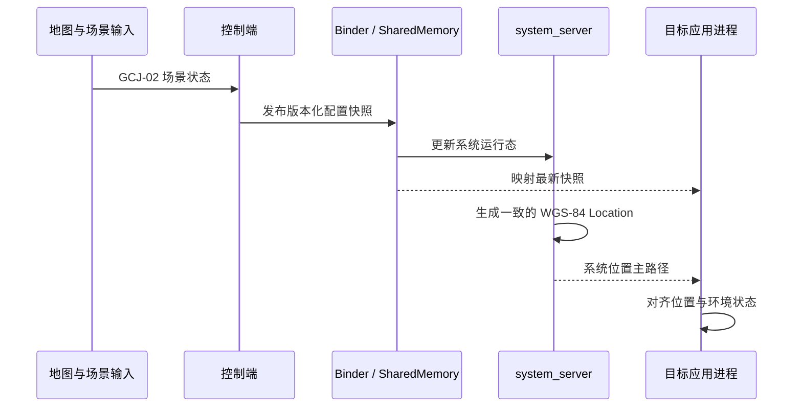

# HLocation

> 面向 Android 系统定位链路的多进程位置场景引擎

HLocation 以 Android 系统服务为位置数据主边界，以目标应用进程为环境一致性边界，并由独立控制端管理地图选点、场景配置与模拟状态。系统采用模块化 Kotlin 架构、Binder 与 SharedMemory 数据平面，以及面向 ARM64 的 Native 运行时边界。

## 技术栈

| 领域 | 技术选型 |
| --- | --- |
| 平台 | minSdk 26、targetSdk 36、compileSdk 37、ARM64 |
| 语言 | Kotlin 2.3.20、C++ 17 |
| 系统扩展 | LSPosed / libxposed API 102 |
| UI | Jetpack Compose、Material 3、Navigation 3 |
| 状态与并发 | Coroutines、Flow、StateFlow |
| 数据与依赖 | Room、KSP、Koin、Kotlin Serialization |
| 地图能力 | 高德 3DMap 与搜索 SDK |
| 进程通信 | Binder、SharedMemory、版本化快照协议 |
| Native 工具链 | Android NDK、CMake |
| 构建系统 | AGP 9、Gradle 9、JDK 17 |

## 架构总览

HLocation 不是单进程位置替换器。它将控制、同步、系统注入、应用环境和运行时保护拆分为相互隔离的平面，每个平面只承担一个稳定职责。

### 控制平面

控制端负责用户交互、地图选点、静态位置、路线与摇杆状态，以及环境配置的持久化。UI、领域状态和配置发布相互分离，界面不直接依赖 Hook 实现。

### 数据平面

跨进程状态以统一快照契约传递。Binder 负责建立连接和提交配置，SharedMemory 负责向多个运行时进程分发高频读取的最新状态；旧平台保留 Binder 读取路径。协议同时维护配置版本与运行时位置序号，使策略更新和路线推进拥有独立时序。

### 运行时平面

- **system_server**：承载 IPC 骨干以及系统位置查询、分发、GNSS 和融合定位边界。
- **电话服务进程**：承载系统蜂窝服务边界，与普通目标应用 Hook 生命周期隔离。
- **目标应用进程**：承载应用侧位置兜底，以及 WiFi、蜂窝、蓝牙、传感器、GNSS 状态和网络环境的一致性处理。

系统层负责位置结果的主路径，应用层负责环境维度与最终一致性。架构不依赖面向特定地图 SDK 的专用 Hook。

### 保护平面

保护能力只约束 HLocation 控制端，不进入 system_server 或目标应用热路径。应用身份、运行时状态和 Native 映像边界独立校验；受保护 API 与受保护运行时采用显式契约连接，避免保护实现反向污染业务模块。

## 模块分层

项目由八个 Gradle 模块组成，编译边界与运行时边界保持分离。

| 模块 | 架构职责 |
| --- | --- |
| `:app` | Compose 控制端、地图交互、配置管理、持久化与模拟编排 |
| `:xposed` | libxposed 生命周期、system_server 与目标进程运行时能力 |
| `:ipc` | Binder 契约、SharedMemory 编解码、版本仲裁与跨进程客户端 |
| `:common` | 不依赖 Android 运行时的共享策略、模型与坐标转换 |
| `:system-api` | 编译期 Android 系统接口边界 |
| `:nmea` | 独立的 NMEA 领域模型与处理能力 |
| `:protected-api` | 控制端与受保护运行时之间的稳定接口 |
| `:protected-runtime` | 可独立构建和验证的受保护控制运行时 |

`:app` 通过 `runtimeOnly` 打包 `:xposed`，不会把 Hook 内部类型引入应用业务编译 API；`:ipc` 与 `:common` 是控制端和运行时共享的稳定边界。

## 数据流

内部坐标以高德地图使用的 GCJ-02 表达，进入 Android `Location` 边界前统一转换为 WGS-84。单次位置构造只读取一个原子坐标快照，确保经纬度、高度、精度、速度和航向来自同一运行时状态。

## 核心设计约束

- **配置单一来源**：所有运行时能力消费同一份版本化配置，不在 Hook 中维护分散参数。
- **坐标契约唯一**：GCJ-02 用于内部场景表达，WGS-84 用于 Android 位置输出。
- **配置与位置分序**：持久配置版本和运行时位置序号独立推进，路线运行不会污染配置仲裁。
- **快照字段一致**：同一个位置对象的全部动态字段来自同一原子状态。
- **真实环境优先**：已有环境快照或可信数据时直接使用；缺失时才进入确定性策略。
- **热路径隔离**：保护、网络、持久化与同步文件写入不进入位置注入热路径。
- **故障域隔离**：控制端、system_server、电话服务和目标应用进程分别处理异常，避免跨进程扩散。

## Android 兼容模型

HLocation 以公开 Android 契约和 libxposed 生命周期为稳定边界，并将系统差异收敛在运行时适配层：

- API 27 及以上使用 SharedMemory 只读映射，API 26 使用 Binder 配置事务。
- 系统位置主路径与应用进程兜底路径相互独立。
- Hook 返回类型按运行时方法签名处理，适配 OEM 对系统 API 的变体。
- 自身 Native 映像执行严格校验；ART、APEX 与 OEM 外部模块按平台对象对待，不将其私有装载布局误作应用身份。
- 内存页尺寸以运行时环境为准，兼容 Android 新版本的 16 KiB page size 演进。

## 架构特征

| 维度 | 设计 |
| --- | --- |
| 一致性 | 系统位置、应用位置和周边环境共享同一状态快照 |
| 延迟 | 配置写入走 Binder，运行态读取走进程内映射 |
| 可维护性 | 平台 Hook、领域策略、IPC 契约和控制 UI 分模块演进 |
| 可测试性 | 纯策略下沉至 JVM 模块，协议、仲裁和异常路径独立验证 |
| 兼容性 | Android 版本差异、OEM 变体和运行时装载差异集中适配 |
| 稳定性 | system_server Hook 采用受控异常边界，控制端保护不进入系统热路径 |
